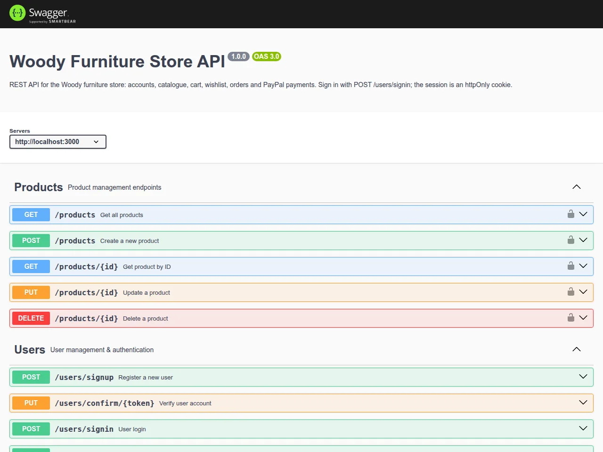

# Woody — Furniture Store API (Node.js + Express + MongoDB)

The REST API behind the Woody furniture store, built by a team of five at ITI (Information Technology Institute).
It handles accounts, the product catalogue, carts, wishlists, orders and PayPal payments.

The React front end is in
[Full-Stack-E-commerce-reactjs-nodejs](https://github.com/montaser-hub/Full-Stack-E-commerce-reactjs-nodejs),
which also has screenshots of the whole app.



## Features

- **Auth**: signup with an email verification link, signin and logout with an httpOnly JWT cookie,
  forgot and reset password, change password, role-based access (`user` / `admin`).
- **Catalogue**: products and categories with admin-only writes; list endpoints support filtering,
  sorting and pagination.
- **Cart and wishlist**: one cart and one wishlist per user, with stock checks when adding to the cart.
- **Orders**: place an order from the cart, order history, cancel, mark as delivered (admin).
  Statuses: `pending`, `paid`, `payment_failed`, `shipped`, `completed`, `cancelled`.
- **Payments**: PayPal checkout (create, capture, cancel) and a webhook.
- **Hardening**: Helmet, HPP, CORS allow-list, Joi validation on create and update requests, central error handler.
- **Docs**: Swagger UI at `/api-docs` and the raw OpenAPI JSON at `/api-docs-json`.

## Tech stack

Node.js · Express 5 · MongoDB + Mongoose · JWT + bcrypt · Joi · Nodemailer · PayPal REST API · Swagger

## Running locally

You need Node.js 20+ and MongoDB. If you don't have MongoDB installed, Docker works:
`docker run -d -p 27017:27017 mongo:7`.

```bash
npm install
cp config.env.example config.env   # then set JWT_SECRET
npm run seed                       # demo catalogue, users, orders (wipes the collections it fills)
npm run dev                        # http://localhost:3000, docs at /api-docs
```

The seed script creates these local demo accounts:

| Role | Email | Password |
|---|---|---|
| Admin | `admin@shop.test` | `Admin1234!` |
| Customer | `sara@shop.test` | `Customer1234!` |

Email and PayPal are optional. Without a mail account, signup still works and the server logs that the
verification email could not be sent; new accounts are active straight away.

## Endpoints

All routes except signup, signin, password reset and the PayPal webhook need a signed-in user.

| Area | Routes |
|---|---|
| Users | `POST /users/signup` · `PUT /users/confirm/:token` · `POST /users/signin` · `POST /users/logout` · `GET /users/check` · `POST /users/forgetPassword` · `PUT /users/resetPassword/:token` · `GET /users/me` · `DELETE /users/deleteMe` · admin CRUD on `/users` |
| Products | `GET /products` · `GET /products/:id` · admin: `POST /products`, `PUT /products/:id`, `DELETE /products/:id` |
| Categories | `GET /categories` · `GET /categories/:id` · admin: `POST`, `PUT`, `DELETE` |
| Cart | `GET /carts` · `POST /carts` · `PUT /carts/items/:productId` · `DELETE /carts/items/:productId` · `DELETE /carts` · admin: `/carts/users` |
| Wishlist | `GET /wishlist` · `POST /wishlist` · `DELETE /wishlist/:productId` |
| Orders | `POST /orders` · `GET /orders/myorders` · `GET /orders/:id` · `PUT /orders/:id/cancel` · admin: `GET /orders`, `PUT /orders/:id/deliver` |
| Payments | `POST /payments/paypal/:orderId` · `POST /payments/paypal/capture` · `POST /payments/paypal/webhook` |

### Query parameters for list endpoints

- Filter: `?categoryId=<id>`, `?price[gte]=500&price[lte]=1500` (operators: `gt`, `gte`, `lt`, `lte`, `in`, `ne`)
- Sort: `?sort=price` or `?sort=-createdAt`
- Paginate: `?page=2&limit=8`

## Project structure

```
Controllers/     Route handlers (auth, users, products, categories, cart, wishlist, orders, payments)
Middelwares/     Auth guard, Joi validation, error handling
Models/          Mongoose schemas
Routes/          Express routers with Swagger annotations
Utils/           Query builder (filter, sort, paginate), email, AppError, Joi schemas
scripts/seed.js  Demo data
Server.js        Loads config.env, connects to MongoDB, starts the server
app.js           Express app: security middleware, routes, docs
```

## Team

| Member | Main areas |
|---|---|
| [Montaser Ismail](https://github.com/montaser-hub) | Auth and users (JWT cookies, email verification, password reset), query builder for filtering, sorting and pagination, wishlist, error handling |
| [Anas Ali](https://github.com/anas-dev000) | Orders and PayPal payments |
| [Tarek Hamdy](https://github.com/tarekhamdy99) | Cart |
| [Mohamed Turki](https://github.com/MohamedTurki7) | Categories |
| [Hager Ramadan](https://github.com/hageramadan) | Products |

## Fixes after the course

Done when preparing the project for this portfolio:

- The server could not start on Linux: two files imported `../utils/` while the folder is `Utils/`, and
  `npm start` pointed at `server.js` instead of `Server.js`.
- Signup crashed the whole server when no mail account was configured: the email promise was not awaited
  or caught, and the unhandled rejection shut the process down.
- Only one cash order could ever exist: `paypalOrderId` had a unique index without `sparse`, so a second order
  without a PayPal id was rejected as a duplicate.
- Updating a product that doesn't exist threw a `ReferenceError` (`next` was not in scope) instead of a 404.
- The admin order list didn't include customer names.
- `POST /payments/paypal/capture` never reached its handler: it was declared after `/paypal/:orderId`, so Express
  treated "capture" as an order id. The PayPal return URL also had a stray `:` before the order id.
- Added `config.env.example`, a seed script and the deployed front end's origin to the CORS allow-list.
- Swagger docs now have a real title and description.

## Known gaps

- The PayPal flow needs sandbox credentials and was not re-tested end to end; there is no route for the cancel
  call the front end makes. Cash orders work end to end.
